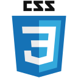

## Greetings! :wave::wave:

_[Versão em pt-br abaixo.]_

My name is Matheus Dias and I'm a (almost) self-taught software developer student.

Although I have a Psychology degree, since 2020 I've been studying software development through a javacript technology stack. So far I've focused specially at frontend apps, but I have some backend knowledge and I still intend to deepen it further.

By the way, I said that I'm _almost_ self-taught because in august 2021 I started a 2 years course on Web Development at <a href="https://www.digitalhouse.com/br/acoes/certified-tech-developer">Digital House</a>.

### Technologies :computer:

That I have some mastery:

- HTML5 
- CSS 
- Javascript 
- ReactJs 

That I can use the basic features:

- NextJs 
- NODEJs 
- Typescript 
- C# 

That I'm looking forward to learn:

- React Native 
- .NET 
- Java 
- Kotlin 

### Most relevant projects :file_folder:

These are not relevant due to the impact they had on some business or on society at large, but due to the level of learning that I had while developing them. I listed them from oldest to newest.

##### Psyte:

My first complete application. I used the React library and Material UI components for the front-end.

For back-end I created a NODE server. The most difficult part was configuring a server-side Webpack script so that I could serve a pre-rendered page so web crawlers could index my website properly.

Also I had little to no idea on how to use Git/Github, not to mention on how to mantain a nice folder structure so Psyte's repo is a mess to be honest.

<a href="https://github.com/Matheus-Days/psyte-app">Here's the link to it.</a>

[The app itself is currently offline]

##### Letmeask:

Letmeask is a front-end studying app that I made by following a tutorial and then making improvements of my own. Because of this I won a scholarship to a <a href="https://rocketseat.com.br/ignite">Rocketseat's</a> paid course.

This one is a much more properly documented project, so I only need to mention it here and you may know more about it better by reading it's `README.md`.

<a href="https://github.com/Matheus-Days/letmeask">Here's the link to the repo.</a>

<a href="https://github.com/Matheus-Days/letmeask">Here's the link the functional app.</a>
