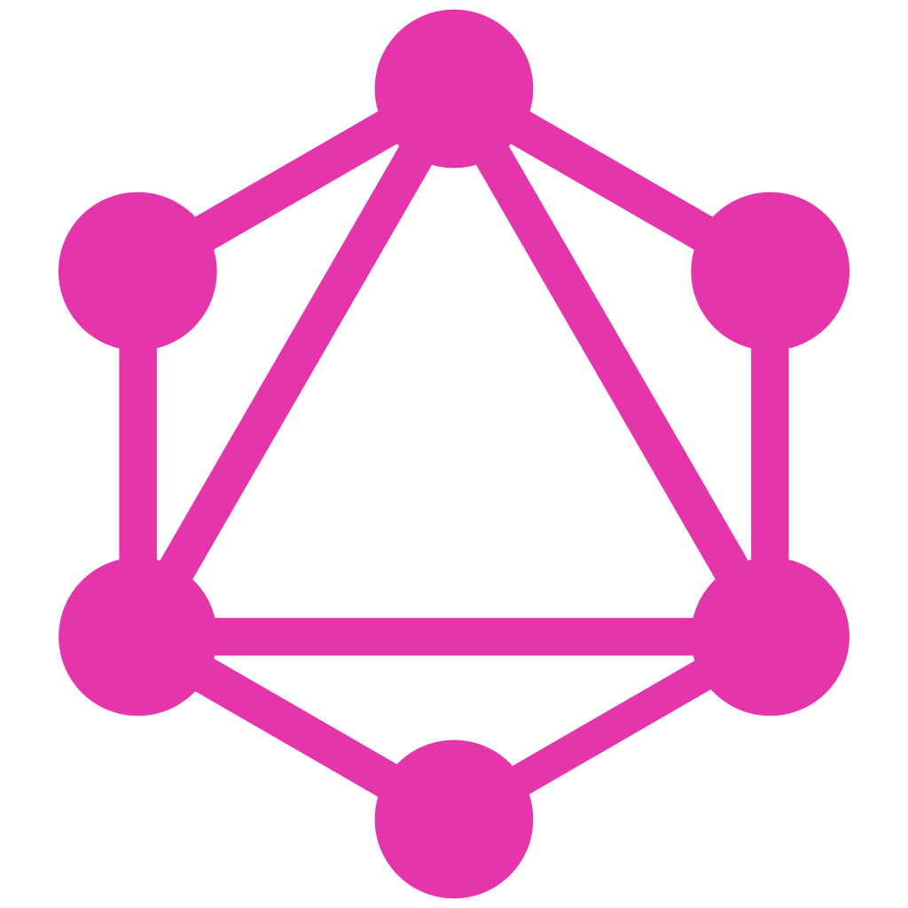

## Greetings! :wave::wave:

My name is Matheus Dias, and I'm a (almost) self-taught software developer.

Although I have a degree in Psychology, since 2020, I've been studying software development using a JavaScript technology stack. So far, I've focused especially on front-end development, but I have some back-end knowledge and still intend to deepen it further.

By the way, I consider myself _almost_ self-taught because in August 2021, I started a Web Development course at <a href="https://www.digitalhouse.com/br/acoes/certified-tech-developer">Digital House</a>, successfully completing its first year. Now, I'm pursuing a Software Engineering undergraduate degree since the beginning of 2024.

### Technologies :computer:

|                        Proficiency |                  Basics Mastered |                                  Studied the Basics |
| -------------------------------: | -----------------------------: | ---------------------------------------------------: |
| HTML  | Apollo  | C#  |
| CSS  | Next.js  | .NET  |
| JavaScript  | Node.js  | Java  |
| React  |  | Spring  |
| TypeScript  |  | React Native  |
| Git  |  |  |
| Angular  |  |  |
| RxJS  |  |  |
| GraphQL  |  |  |
| Tiptap  |  |  |

## Latest Projects :file_folder:

See below my latest projects listed from newest to oldest.

---

### 

In collaboration with [Carina](https://www.linkedin.com/in/carina-torquato-174467229/) who designed the UI, I developed the landing page for Practicus company. It focuses on promoting their products, events, and company public information. It also has a blog feature that will be enabled as soon as the article author starts posting.

For better SEO (search engine optimization), I chose to develop the app with Next.js, relying on its SSR and SSG features to achieve higher Lighthouse metrics evaluations and to ensure proper indexing by search engine crawlers.

Additionally, the client requested a website that they could update frequently, so I opted to use a CMS (Content Management System), specifically Prismic, which offers great pricing for low-traffic projects like this one.

For styling, I primarily used Tailwind CSS, but I also incorporated some components from MUI and custom styled them.

[Here's the link to the repo.](https://github.com/matheus-days/practicus)

[And here's the link to the website.](https://practicus.com.br)

---

###  Compila-p (prototype)

During the development of the Practicus website, one of the owners requested a tool to compile the results of specific queries from the [TCE API](https://api-dados-abertos.tce.ce.gov.br/docs/#/) into an XLSX workbook.

This led me to develop a prototype using Angular that met his needs with minimal UX/UI efforts. I hosted the prototype for free at Netlify.

[Here's the link to the repo.](https://github.com/matheus-days/compila-p)

[And here's the link to the website.](https://compilap.netlify.app/)

---

### 

One of my Software Engineering disciplines is a recurring extension project, which every semester requires me to participate in some project for and with my local community. In my first semester, I chose to help a local business improve their online presence by creating a landing page.

The client is an automotive workshop, and for the design, I got help from one of the owner's sisters who works in UX design. Together, we gathered the requirements with the owner, and then I began development.

The project didn't require any complicated features but needed to be blazing fast and crawlable for SEO. Therefore, I chose to use only vanilla HTML5, CSS3, and JavaScript. For bundling, I used Vite, as it would not be optimal to serve non-minified files, and my development workflow would be hindered by using only native `import` syntax.

After delivery, the client decided to wait before choosing a custom domain, so we left the URL provided by Netlify (where we hosted the landing page) unchanged.

[Here's the link to the repo.](https://github.com/Matheus-Days/eduardo-autos)

[And here's the link to the functional website.](https://eduardo-autos.netlify.app/)

---

### 

DAMA is an amazing product by [Audo](https://www.audo.com.br/), and I was hired to develop its marketing website.

It's a simple landing page, but this was my first freelance project, so I learned a lot about coding under third-party deadlines, with third-party design, and towards a goal not set by me.

I still had the freedom to choose the technologies I wanted, as long as the final product would be a statically served folder, so I found a way to use TSX in this project.

[Here's the link to the repo.](https://github.com/Matheus-Days/dama-website)

[And here's the link to the functional website.](http://damacad.com.br/)

### How to Reach Me :mailbox_with_mail:

📧 <a href="mailto:matheusbragaprofissional@gmail.com">matheusbragaprofissional@gmail.com</a>

💼 <a href="https://www.linkedin.com/in/matheus-braga-dias-6129a31b0/">My LinkedIn Profile</a>
